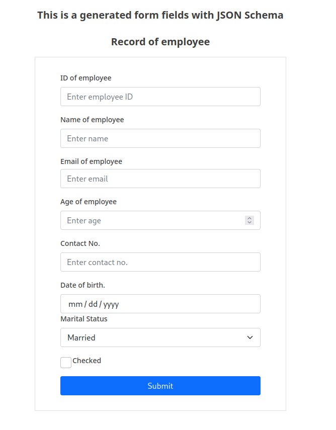

This is a simple React App that generates form components using JSon Schema.


Example:
From given Schema:

``` [
    {
        "title": "Record of employee",
        "fields": [
            {
                "field_id": "id",
                "field_label": "ID of employee",
                "field_placeholder": "Enter employee ID",
                "field_type": "text",
                "field_value": ""
                
            },
            {
                "field_id": "Name",
                "field_label": "Name of employee",
                "field_placeholder": "Enter name",
                "field_type": "text",
                "field_value": ""
            },
            {
                "field_id": "email",
                "field_label": "Email of employee",
                "field_error": "Enter valid e-mail address",
                "field_placeholder": "Enter email",
                "field_type": "email"
            },
            {
                "field_id": "age",
                "field_label": "Age of employee",
                
                "field_placeholder": "Enter age",
                "field_type":"number"
            },
            {
                "field_id": "contact",
                "field_label": "Contact No.",
                
                "field_placeholder": "Enter contact no.",
                "field_type": "number"
            },
            {
                "field_id": "dateofbirth",
                "field_label": "Date of birth.",
                "field_placeholder": "Date-of-birth",
                "field_type": "date"
            },
            {
                "field_id": "marital_status",
                "field_label": "Marital Status",
                "field_value": "Select an option",
                "field_mandatory": "yes",
                "field_options": [
                    {
                        "option_label": "Married"
                    },
                    {
                        "option_label": "Single"
                    }
                ],
                "field_type": "select"
            },
            {
                "field_id": "checkbox",
                "field_label": "Checked",
                "field_type": "checkbox"
                
            }
            
        ]
    }
]
```

It generates Form Component:


